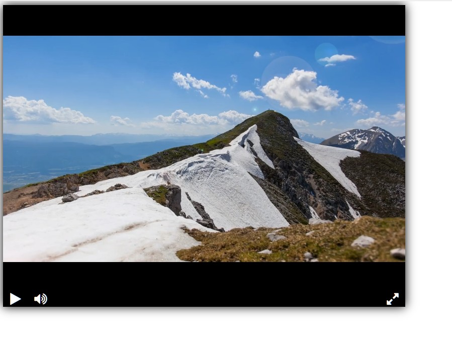

### Урок 1. Верстаем видеоплеер

Урок из [devman](https://dvmn.org/), модуль Продвинутая вёрстка в Django.

Создание видеоплеера 

посмотреть по адресу [адрес сайта](https://alexed34.github.io/devman_django-layout_1/)

